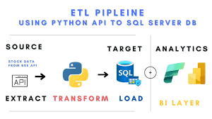

# Uber_ETL Data Analytics

Main source Link: https://github.com/Shyam414/YT_Data

# Introduction

Hi Shyam Sundar! The project's objective is to utilize YouTube APIs to extract data from various YouTube channels with different channel IDs. Following data extraction, the data will be cleaned and loaded into a PostgreSQL database. Subsequently, Power BI will be employed to visualize the data. The primary aim is to establish a seamless pipeline from API extraction to visualization.

## Data_Architecture

## Technology Used
- Programming Language - Python
- Storage - PostgreSQL
- Data Visualization - PowerBI
- deployment - Github
- source-You Tube API

  Data Pipeine : Api-->Python-->Postgresql--> Python-->Postgresql-->PowerBI

## Dataset source
To create an API key for accessing the YouTube Data API, you can follow these steps:

1)Go to the Google Cloud Console: https://console.cloud.google.com/apis/credentials  
2)If prompted, sign in with your Google account.

3)Once logged in, select the project where you want to create the API key, or create a new project if needed. You can do this by clicking on the project dropdown menu at the top of the page.

4)Once you've selected or created the project, click on the "Create credentials" button and select "API key" from the dropdown menu.

5)Your API key will be generated. Make sure to copy and securely store the API key, as you'll need it to authenticate your requests to the YouTube Data API.

